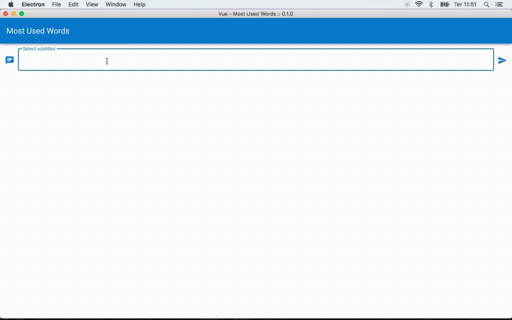

# Vue Most Used Words
A Desktop application made with Electron and Vueto read SRT subtitles in order to show the most used words.

## Screenshots


## Dependencies
- Electron
- VueJS

## Dev dependencies
To run on dev environment run:

```sh
npm install -g @vue/cli
npm install
npm npm run electron:serve

```
> The Application will run on Desktop

## See more
For more information about me or other projects: [brenomachado.dev](https://brenomachado.dev)